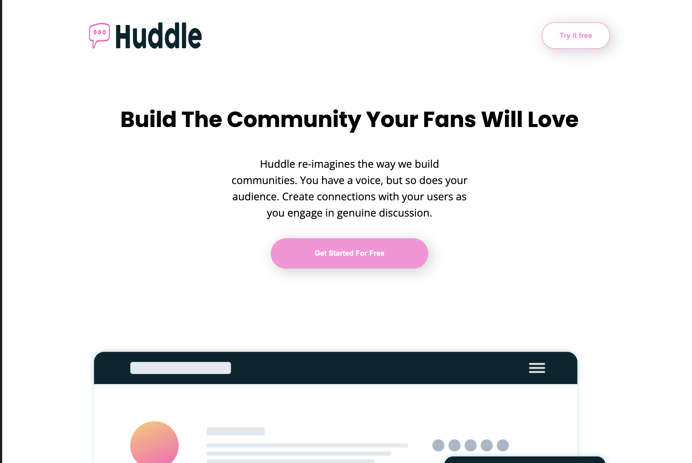

# Frontend Mentor - Huddle landing page with curved sections

## Table of contents

- [Overview](#overview)
    - [The challenge](#the-challenge)
    - [Screenshot](#screenshot)
    - [Links](#links)
- [My process](#my-process)
    - [Built with](#built-with)
    - [What I learned](#what-i-learned)
    - [Continued development](#continued-development)
    - [Useful resources](#useful-resources)
- [Author](#author)

## Overview

### The challenge

Users should be able to:

- View the optimal layout depending on their device's screen size
- See hover states for interactive elements

### Screenshot

### Links

- Solution URL: [Repository](https://github.com/alexcu21/huddle-landingpage)
- Live Site URL: [live site](https://alexcu21.github.io/huddle-landingpage/)

## My process

### Built with

- Semantic HTML5 markup
- Sass
- Flexbox
- CSS Grid
- Gulp

### What I learned

I've learned new stuffs about CSS and Flexbox.

### Continued development

I think I need to implement more BEM design.

### Useful resources

- [Developer Mozilla documentation](https://developer.mozilla.org/en-US/docs/Web/CSS/box-shadow) - this helped to
  refresh about box model and shadows.
- [flexbox guide](https://css-tricks.com/snippets/css/a-guide-to-flexbox/) - this is the best resource about flexbox.

## Author

- Website - [Alex Cuadra](https://twitter.com/alexcuadr4)
- Frontend Mentor - [@alexcu21](https://www.frontendmentor.io/profile/alexcu21)
- Twitter - [@alexcuadr4](https://twitter.com/alexcuadr4)
